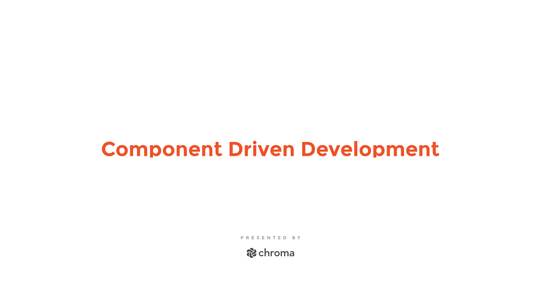

# CDD - Component Driven Development

Building user interfaces with modular components.

Benefits

- Quality
- Durability
- Speed
- Efficiency

Not Component Driven

- Page-based
- Tools designed for pages

##

